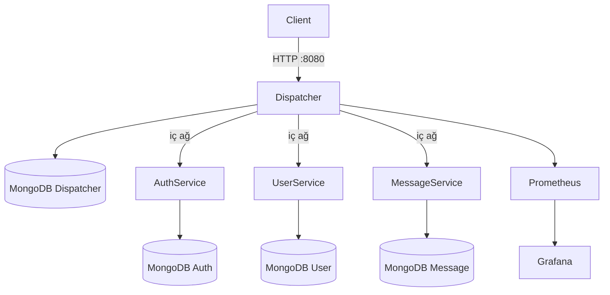
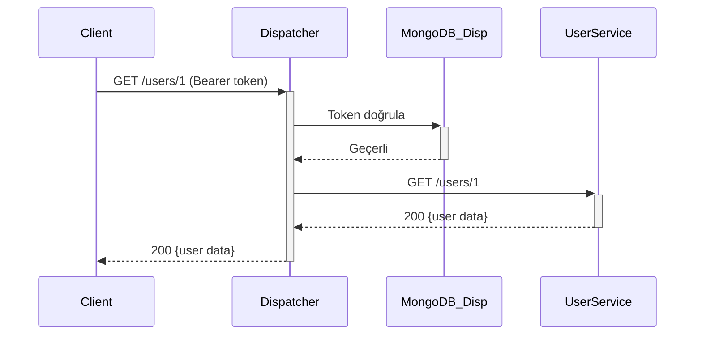
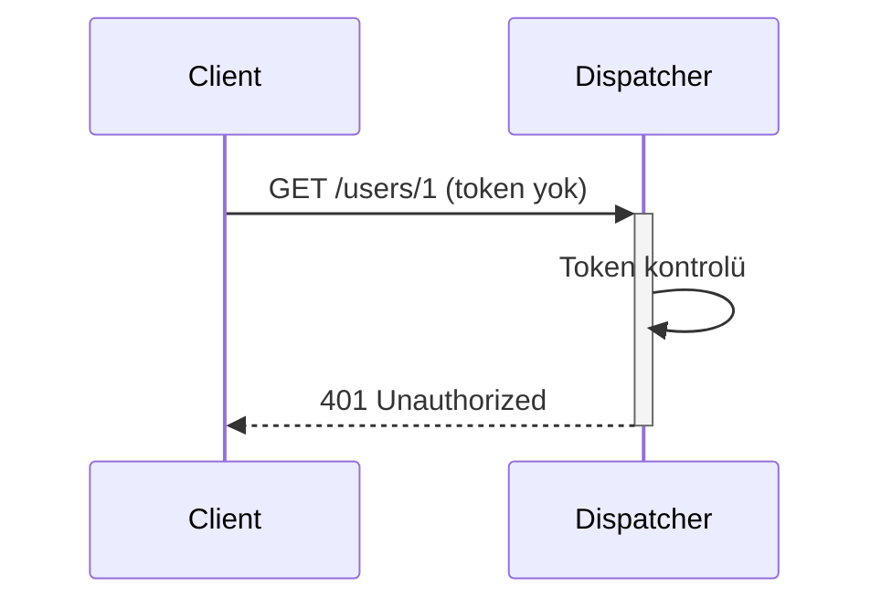

# Mimari Diyagramlar — Dispatcher Microservice

## Sistem Mimarisi

```mermaid
graph TD
    Client -->|HTTP :8080| Dispatcher
    Dispatcher --> MongoDB_Disp[(MongoDB Dispatcher)]
    Dispatcher -->|iç ağ| AuthService
    Dispatcher -->|iç ağ| UserService
    Dispatcher -->|iç ağ| MessageService
    AuthService --> MongoDB_Auth[(MongoDB Auth)]
    UserService --> MongoDB_User[(MongoDB User)]
    MessageService --> MongoDB_Msg[(MongoDB Message)]
    Dispatcher --> Prometheus
    Prometheus --> Grafana
```

## İstek Akış Diyagramı (Başarılı)

```mermaid
sequenceDiagram
    Client->>+Dispatcher: GET /users/1 (Bearer token)
    Dispatcher->>+MongoDB_Disp: Token doğrula
    MongoDB_Disp-->>-Dispatcher: Geçerli
    Dispatcher->>+UserService: GET /users/1
    UserService-->>-Dispatcher: 200 {user data}
    Dispatcher-->>-Client: 200 {user data}
```

## İstek Akış Diyagramı (Yetkisiz)

```mermaid
sequenceDiagram
    Client->>+Dispatcher: GET /users/1 (token yok)
    Dispatcher->>Dispatcher: Token kontrolü
    Dispatcher-->>-Client: 401 Unauthorized
```
